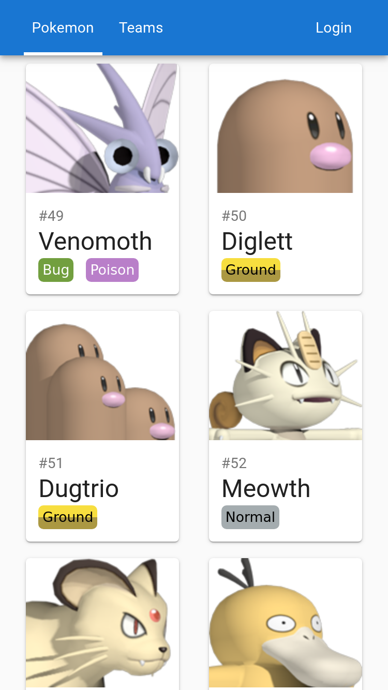
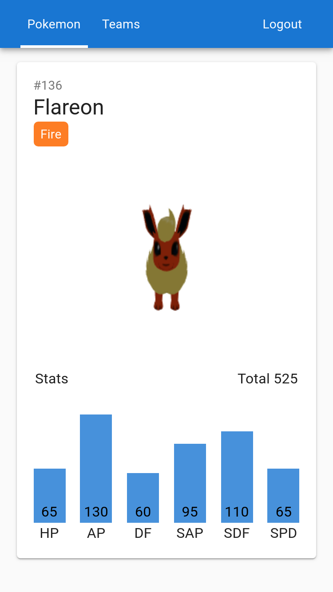
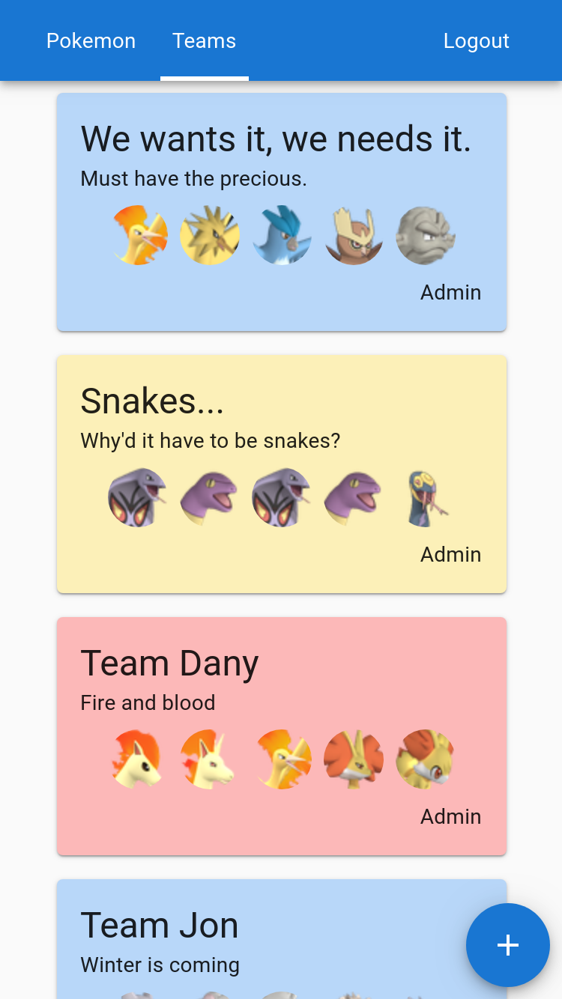
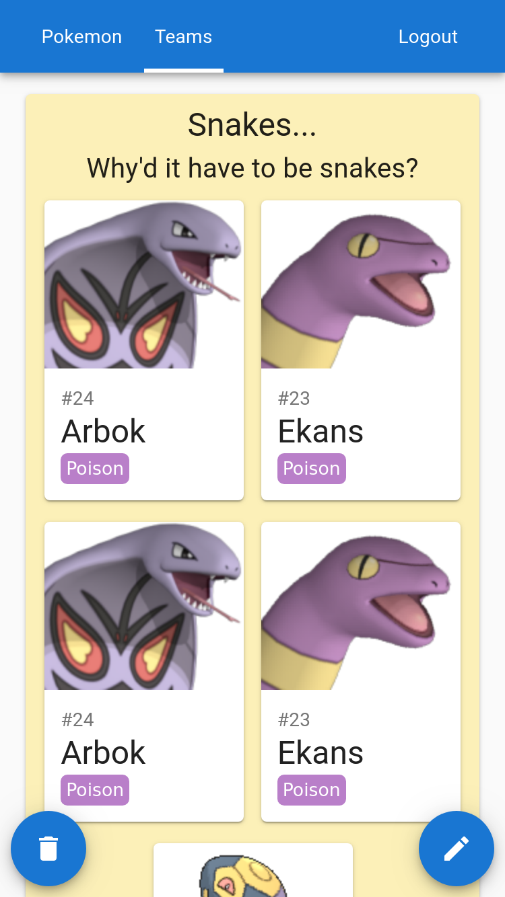

[](https://travis-ci.org/Nalhin/PokemonTeams) [](https://codecov.io/gh/Nalhin/PokemonTeams)

# Pokemon Teams

A web application that allows users to create teams consisting of their favourite Pokemon and share them with others. Users can also inspect 3D models of their favourite pokemon courtesy of Thee.js.
It is written in Typescript utilizing React with Flux architecture (Redux). Material UI was used as the component library of choice. Styling in Typescript with Emotion library (styled) where needed. Communication between frontend and backend was implemented with the use of REST API.
Each request is handled with its own saga, and stored in Redux for cache management. Backend is written in Typescript with Express framework. Authentication implemented with http-only cookies (JWT) attached to each request. 
As far as database is concerned, MongoDB was chosen, after the evaluation of data complexity (multiple relations were not needed). 

## Showcase
[Video](https://youtu.be/jDBPPlOJ_EU)

[](https://youtu.be/jDBPPlOJ_EU)










## Folder Structure

#### Frontend

* components (Reusable Components used throughout the entire application)
* interfaces (Typescript interfaces)
* routes (React router routes with corresponding Components)
* store (Redux boilerplate implemented in "Duck" architecture - feature first approach). Each folder consists of (unless not required by implementation) the following:
    * *.actions.ts 
    * *.reducer.ts
    * *.saga.ts 
    * *.types.ts
    * *.api.ts
* styles (Styling constants like padding or color)
* utils (Utility functions)
* \__tests__ (Test files are always located next to functionality)

#### Backend

Feature first approach (so called "Duck" architecture).
Each folder consists of (unless not required by implementation) the following:

* *.controller.ts (Routes implementation)
* *.interface.ts (Typescript definitions)
* *.model.ts (Mongoose model)
* *.router.ts (Express routes)
* \__tests__ (Test files are always located next to functionality)

## Technology Stack

#### App

* Typescript
* React
* React Router
* Redux
* Redux-Saga
* Three.js
* Emotion
* Material UI

#### Backend

* Node
* Typescript
* Express
* Mongodb
* Mongoose
* JWT

#### Testing

* Jest
* React Testing Library
* Supertest
* Travis
* Codecov

#### Data

* Python
* Beautiful Soup
* Pillow 
* Zipfile

## API

[API Postman documentation](https://documenter.getpostman.com/view/8005247/SVtbRkgN?version=latest).

## Models, Images and Data

All models and images are downloaded from [this](https://www.models-resource.com/3ds/pokemonxy/) website via python web scrapping scripts.
After being downloaded, models are then converted to .glb format with open source converters ([fbx2glb](https://github.com/facebookincubator/FBX2glTF), [obj2glb](https://www.npmjs.com/package/obj2gltf), [collada2glb](https://github.com/KhronosGroup/COLLADA2GLTF)).
Pokemon data is gathered from [pokemondb](https://pokemondb.net/pokedex/all).

## Requirements

Install node package manager [npm](https://www.npmjs.com/).
You should be able to run the following commands.

```bash
node --version
npm --version
```

Install [mongodb](https://www.mongodb.com/) and add it to PATH.
You should be able to run the following command.

```bash
mongo --version
```

## App

#### Installation

```bash
git clone https://github.com/Nalhin/PokemonTeams
cd app
npm install
```

####  Start

```bash
cd app
npm run start
```

## Backend

#### Installation

```bash
git clone https://github.com/Nalhin/PokemonTeams
cd server
npm install
cd ../data
import_into_local_mongodb.bat
```

####  Start

```bash
cd server
npm run start
```

## License

This project is licensed under the MIT License - see the [LICENSE.md](LICENSE.md) file for details.
